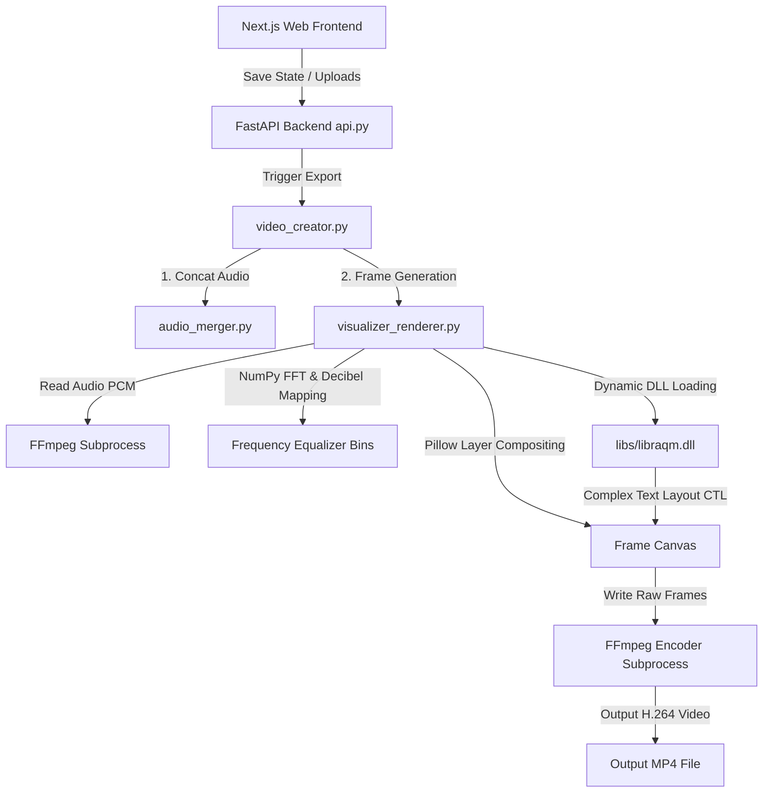

# Visual Music Longplay Creator

A high-performance web-based system and Python backend pipeline to generate beautiful, long-form music playlist videos (Longplays) with dynamic visualizer effects, soft glow halo styles, and perfect Thai typography.

---

## 🛠️ System Architecture

The application is split into a Next.js single-page frontend (preview/editor) and a high-performance FastAPI backend coordinating FFmpeg and Pillow.

### 1. Frontend Layer (`frontend/`)
* **Technology Stack**: Next.js, React, Vanilla CSS.
* **Canvas Preview (`canvas_visualizer.js`)**: Uses HTML5 Canvas API and Web Audio API (`AnalyserNode`) to animate real-time visualizer previews dynamically in the browser.

### 2. Backend API Controller (`api.py`)
* **Technology Stack**: FastAPI, Uvicorn (with hot-reloading).
* **Responsibilities**: Manages uploading media, workspace configurations, project states, and monitors the asynchronous background export process.

### 3. Core Processing Engine (`modules/`)
* **[audio_merger.py](file:///d:/Project/Jaihug_Longplay/modules/audio_merger.py)**: Combines multiple audio files into a single master MP3 track, utilizing smart demuxing or re-encoding, and automatically outputs the synchronization timeline text files.
* **[visualizer_renderer.py](file:///d:/Project/Jaihug_Longplay/modules/visualizer_renderer.py)**: The heavy-duty video renderer. 
  - Launches an FFmpeg reader subprocess to extract raw audio PCM.
  - Computes FFT frequencies on audio chunks per frame using NumPy.
  - Draws visualizer bars, background overlays, soft Gaussian glow layers, and dynamic text onto Pillow canvases.
  - Pipes raw image frame streams into an FFmpeg writer subprocess utilizing hardware-accelerated encoders (NVIDIA NVENC, Intel QSV, or CPU x264).
* **[video_creator.py](file:///d:/Project/Jaihug_Longplay/modules/video_creator.py)**: Orchestrates the merge and frame rendering processes, cleaning up intermediate resources once complete.
* **[utils.py](file:///d:/Project/Jaihug_Longplay/modules/utils.py)**: 
  - Dynamic DLL Binder: Adds local `libs/` folder to Windows search paths (`os.add_dll_directory`) to bind `libraqm` on startup.
  - Complex Text Layout (CTL): Shapes Thai text correctly using OpenType GPOS anchor tables to prevent vowels/tone-marks overlapping.
  - Auto-downloads Google Fonts (Sarabun, Mali, Noto Sans Thai, Inter).

---

## 📈 Version Changelog (Version Log)

### `v1.3.0` — 80-Bar Independent Equalizer & FFT Alignment (Current)
* **Independent 80-Bar Mapping**: Shifted "Spectrum Bars" from mirrored dome mapping to an independent 80-bar layout representing a real graphic equalizer. Frequencies now flow logically from low (bass) on the left to high (treble) on the right.
* **Frequency Range Calibration**: Solved the visual "stiff/dull" movement in the exported video. Extended the backend's active frequency cutoff from 1.9kHz up to **~13.8kHz** (capturing mid-vocals and high percussion/cymbals details to match the frontend preview).
* **Sensitivity Alignment**: Matched Web Audio API default dynamic range mapping by using **`[-90.0, -30.0]` dB** range instead of `[-75.0, -15.0]`, allowing soft frequency changes to bounce highly and dynamically.
* **End-to-End Stability**: Verified and passed all integration tests.

### `v1.2.1` — Thai Typography & Stacking Correction
* **Transposition Bug Fix**: Fixed a crucial regex reordering bug where standard `tone_mark + ำ` sequences (e.g. `น้ำ`) were incorrectly swapped into `ำ + tone_mark`, causing layout gaps.
* **Visual Validation**: Verified perfect stacking under `Noto Sans Thai` and `Sarabun` fonts (Mai Tho `้` rendering correctly above the Nikhahit circle `ํ` without any trailing gaps).

### `v1.2.0` — libraqm DLL Integration & Complex Text Layout
* **Dynamic libraqm Binding**: Solved Thai vowel overlapping issues by copying native `libraqm` binaries (`libraqm-0.dll`, `libfreetype-6.dll`, `libfribidi-0.dll`, `libharfbuzz-0.dll`) to `libs/` and dynamically linking them for Pillow on Windows.
* **Native shaping**: Switched rendering to Pillow's native complex layout using `direction="ltr"`.

### `v1.1.0` — Glow Aura & Spacing Adjustments
* **Visualizer Glow**: Added a soft blurred halo aura around visualizer bars using alpha-composited Gaussian blur layers.
* **Spacing adjustment**: Increased visualizer bar fill ratio from `45%` to `70%` for tighter spacing, and repositioned track titles below the visualizer to create a music-player look.
* **Corner Styling**: Rendered clean rectangular bars instead of rounded bars.

### `v1.0.0` — Initial Release
* Basic Next.js frontend and FastAPI backend integration.
* Timeline output generation.
* Mirror-based frequency visualizer.

---

## 🚀 Future Development Roadmap (แผนการพัฒนาตามเฟส)

### Phase 1: Advanced Backgrounds & Layouts (ระบบพื้นหลังและขนาดแนวตั้ง)
* **Vertical Video Support (9:16)**: Add 1080x1920 resolution templates tailored for YouTube Shorts, TikTok, and Instagram Reels (optimized positions for visualizer bars and titles).
* **Video Backgrounds**: Support `.mp4` video files as background media instead of static images.
* **Seamless Video Looping**: Automatically loop short background videos to match the playlist duration using FFmpeg filters (`xfade` for smooth crossfading transitions or reverse/ping-pong looping for seamless visual continuation).
* **Smart Background Mapping**:
  * **1 Background / 1 Song**: Assign a unique image or video to each track.
  * **N Backgrounds / 1 Song (Slideshow)**: Cycle multiple images within a single song.

### Phase 2: Visualizer Aesthetics & Rendering Optimization (เอฟเฟกต์และการเรนเดอร์)
* **Gradient Visualizer Bars**: Allow customizable linear/radial color gradients on equalizer bars.
* **Song Title Transitions**: Add smooth transition animations (Fade-in, Slide-up) when changing tracks.
* **Engine Acceleration**: 
  * Integrate GPU rendering (ModernGL/Shaders) for visualizer drawing and blurs to achieve 3x–5x faster exports.
  * Implement frame-piping multithreading to parallelize rendering and FFmpeg writing.

### Phase 3: Synchronized Lyrics Captioning (ระบบเนื้อร้องและเอไอซิงค์)
* **Lyrics Subtitles Import**: Support `.srt` and `.ass` file uploads to display timed lyrics/caption animations.
* **AI Transcription**: Integrate AI speech-to-text models (such as Whisper) to automatically transcribe Thai lyrics from tracks and generate timestamps.

